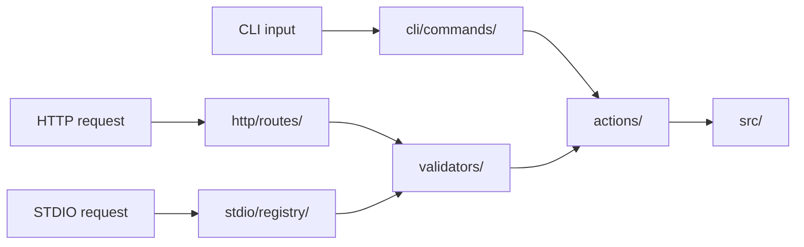

# Contributing to Codryn

Thanks for stopping by. Codryn is in beta, so every report and fix counts.

### You do not need to write code

Contributing is not only about pull requests. Opening an issue, reporting a bug you hit, sharing clear repro steps, improving docs, or suggesting an idea are all real contributions and very welcome.

## House rules

These apply to every contribution, code or not:

- Always use English, in code, comments, issues, and pull requests.
- In code comments, stick to standard keyboard characters. No em dashes, arrows, or other special symbols.

## Contributing to `src/`: the stable core

`src/` is the layered heart of the backend. Every feature domain lives under `src/<Domain>/` with the same internal layout, top to bottom:

```text
src/<Domain>/
├── index.ts        # public API of the domain, re-exports everything
├── types/          # TypeScript types and Zod schemas
├── schemas/        # database schema definitions (Drizzle), storage only
├── errors/         # domain errors, mandatory in every domain
├── engines/        # pure core logic, zero dependencies (optional)
├── storages/
│   ├── cold/       # persistent storage, talks to the database
│   └── hot/        # volatile cache, optional
├── repository/     # mediates storages, validates everything with Zod
├── services/       # business logic, orchestrates the layers above
└── utils/          # shared helpers, optional
```

If you contribute here, follow the layer contract:

- **One-way dependencies.** `services/` may use `repository/` and `engines/`. `repository/` may use `storages/`. `storages/` may use nothing above them. Never circular, never skip a layer: services must not call `storages/` directly.
- **Zod at the boundary.** Every external input is parsed with Zod once, at the `repository/` level. After that the typed result is trusted. Raw database rows must never escape the repository.
- **Never swallow errors.** No layer inside `src/` may log-and-ignore an error or replace it with `null`, `undefined`, or an empty value. Translate or enrich it if you must, then re-throw with a structured error (`code`, `message`, `statusCode`, plus context). Only `apps/` decides how an error is presented.
- **Interface first.** Define the interface in `types/`, then implement it with a class. Class names use `implements` explicitly. Never put classes inside `types/`.
- **One job per file.** If a file starts doing two things, split it. File names carry no layer suffix: `user.ts`, not `user.repository.ts`. If a class grows past roughly 125 lines, split it into a sub-folder with an aggregating file.
- **No config or env inside `src/`.** It only handles config passed in from the outside. Environment and file config belong to `apps/`. (Perhaps not right now; that is because Blank Page-Ctrl (as the author) focused primarily on features during the initial stages of development.)

Because of this contract, `src/` welcomes fixes, hardening, performance work, and tests. New features inside `src/` need maintainer approval first, so please open an issue and discuss it before writing code. That keeps the core stable while still leaving the door open.

## Contributing to `apps/`: keep the flow tidy

`apps/` is the delivery layer and is much freer, as long as the request flow stays clean:



- **Actions are pure.** Files in `actions/` contain one use case each (`<verb>.<domain>.ts`) and import nothing from network frameworks. No Fastify, no Commander, no `ws`.
- **Routes are thin.** A route parses the request, validates it, calls an action, and formats the response. No business logic, no database calls in route handlers.
- **Validate at the boundary.** Zod schemas live in `apps/validators/` and run before any action. Do not scatter inline parsing through routes.
- **One composition root.** All dependencies are wired once in `bootstrap.ts`. Do not build a second one in a command or route.

Good places to contribute freely are `apps/` (actions, routes, skills, MCP, providers), `test/`, docs, and the install scripts.

## Opening an issue

For bugs, include the Codryn version, your OS and architecture, the provider and model if relevant, steps to reproduce, what you expected versus what happened, and the relevant part of the logs (never paste secrets or tokens). For ideas, describe the problem first, then the proposed change, which area it touches, and alternatives you considered.

## Pull requests

Open a pull request and fill in the template that GitHub loads automatically (`.github/PULL_REQUEST_TEMPLATE.md`). Keep one topic per pull request, describe how you verified it, and make sure these pass:

```sh
npm run lint
npm run format:check
npm run typecheck
npm test
```
